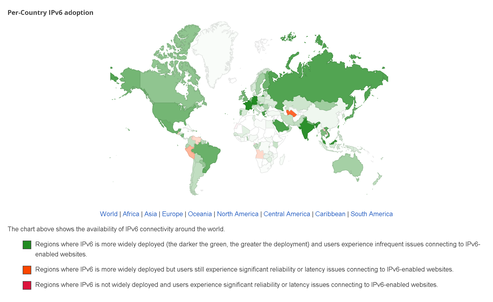

# Как обойти DPI

В данном гайде я расскажу как исправить проблему зависающего YouTube и заблокированных сайтов с помощью различных программ обхода блокировок **DPI** (Deep Packet Inspection / Глубокое исследование пакетов).
> [!WARNING]
> В работу DPI погружать не буду, а сразу перейду к делу. Если есть желание узнать об этой технологии, вам [сюда](https://web.archive.org/web/20230331233644/https://habr.com/ru/post/335436/), или [туда](https://ru.wikipedia.org/wiki/Deep_packet_inspection), или [here](https://geneva.cs.umd.edu/papers/geneva_ccs19.pdf).

- [Как обойти DPI](#как-обойти-dpi)
  - [GoodByeDPI (Windows)](#goodbyedpi-windows)
  - [Zapret для YouTube (Linux / Роутеры)](#zapret-для-youtube-linux--роутеры)
  - [Zapret для всех блокировок](#zapret-для-всех-блокировок)
  - [Zapret (Windows)](#zapret-windows)
  - [Zapret, но круче (Windows)](#zapret-но-круче-windows)
  - [Zapret не менее крутой (Windows)](#zapret-не-менее-крутой-windows)
  - [SpoofDPI (Linux / MacOS)](#spoofdpi-linux--macos)
  - [ByeDPI (Android)](#byedpi-android)
  - [YouTube через IPv6](#youtube-через-ipv6)
  - [Решение возникших проблем](#решение-возникших-проблем)
    - [GoodByeDPI не работает](#goodbyedpi-не-работает)
    - [Скрипты Zapret не являются исполняемыми](#скрипты-zapret-не-являются-исполняемыми)
    - [Нет Bash](#нет-bash)
    - [Zapret не запущен](#zapret-не-запущен)
    - [ByeDPI жрет много батареи](#byedpi-жрет-много-батареи)
  - [Источники / Готовые конфиги](#источники--готовые-конфиги)
  - [Поддержка](#поддержка)

## GoodByeDPI (Windows)
1. Скачайте архив с [GoodByeDPI](https://github.com/ValdikSS/GoodbyeDPI/releases)
2. Распаковываем.
3. Заходим в папку с программой и редактируем файл:
  
   - Если вам нужен YouTube рекомендую пользоваться:
    ```
    1_russia_blacklist_YOUTUBE.cmd
    1_russia_blacklist_YOUTUBE_ALT.cmd
    ```
   - Ну а если нужна раблокировка всех сайтов, но необязательно YouTube, то открываем:
    `1_russia_blacklist.cmd`

   - Не рекомендуется использовать скрипты :
     ```
     service_install_russia_blacklist.cmd
     service_install_russia_blacklist_dnsredir.cmd
     service_install_russia_blacklist_YOUTUBE.cmd
     service_install_russia_blacklist_YOUTUBE_ALT.cmd
     ```

Так как они устанавливают службу в Windows, а потом их сложно будет выкорчевывать из системы. В добавок могут не открываться сайты _(якобы нет интернета)_, а также есть вероятность срабатывания античит системы в игре на GoodByeDPI. 
    

4. После строчки `goodbyedpi.exe` вместо `-9` вставим цифру в соответствии от вашего [провайдера](https://github.com/ValdikSS/GoodbyeDPI/issues/378).
5. Ну а после `--fake-from-hex` всталяем рандомный hex, с помощью [hex генератора](https://www.browserling.com/tools/random-hex). В графе `How many digits?` вводим **120** и более, а после нажимаем `Generate Hex`, копируем и вставляем в файл.
6. Сохраняем и выходим.
7. И запускаем нужный нам скрипт.

## Zapret для YouTube (Linux / Роутеры)
1. Необходимо скачать программу и необходимые компоненты. Сделаем мы это с помощью Git. 

Установка на [Linux](https://git-scm.com/downloads/linux):
- Debian / Ubuntu / Debian подобные:
  `sudo apt-get install git curl ip6tables ipset iptables`

- Либо для Ubuntu:
  `add-apt-repository ppa:git-core/ppa`
  `sudo apt update && apt install git curl ip6tables ipset iptables`

- Arch / Arch подобные:
  `sudo pacman -S git dnsutils curl ip6tables ipset iptables`

-  Red Hat / Fedora / Red Hat подобные:
  `sudo dnf install git curl iptables ipset`

- NixOs:
  `sudo nix-env -i git curl ipset iptables`

- Gentoo:
  ```
  emerge --ask --verbose dev-vcs/git
  emerge --ask --verbose net-misc/curl
  emerge --ask --verbose net-firewall/ipset
  emerge --ask --verbose net-firewall/iptables
  ```

- [OpenWrt](https://gist.github.com/kolyanok/6e93f3ed5f3aefb4d482df8c4463f196) / [Keenetic](https://telegra.ph/Nastrojka-zapret-ot-bol-van-na-Keenetic-08-18):
  ```
  opkg update
  opkg install iptables-mod-extra iptables-mod-nfqueue iptables-mod-filter iptables-mod-ipopt iptables-mod-conntrack-extra ipset curl ip6tables-mod-nat grep git-http curl gzip ipset iptables nano ca-certificates
  mkdir /opt # Если директории нет
  ```

2. Клонируем архив с программой
   `git clone https://github.com/bol-van/zapret /opt/zapret`

3. **(OpenWRT/Keenetic пропускаем логин в рут)** Переходим в папку с Zapret из под рута
   `su -`
    Вводим пароль root\`а
   `cd /opt/zapret`

4. Далее запускаем скрипты установки всех нужных компонентов
   `./install_bin.sh`
   `./install_prereq.sh`

> [!NOTE]
> Если нужна разблокировка других сервисов, то смотрим на этот [пункт](#zapret-для-всех-блокировок).

5. Запускаем скрипт установки службы
   `./install_easy.sh`

   И делаем следующее:
    - _Select firewall type_ - Выбираем на свое усмотрение
    - _enable IPV6 support_ - Выбираем отталкиваясь от того какой версии IP вы пользуетесь
    - _select MODE_ - Рекомендую выбирать между tpws и nfqws. Я буду показывать напримере **nfqws**, т.к. работает она лучше.
    - _do you want to edit the options_ - Да, мы хотим изменить, а потому вводим `Y` и изменяем опции:

    ```
    NFQWS_OPT_DESYNC=""
    #NFQWS_OPT_DESYNC_SUFFIX=
    #NFQWS_OPT_DESYNC_HTTP=
    #NFQWS_OPT_DESYNC_HTTP_SUFFIX=
    #NFQWS_OPT_DESYNC_HTTPS=
    #NFQWS_OPT_DESYNC_HTTPS_SUFFIX=
    #NFQWS_OPT_DESYNC_HTTP6=
    #NFQWS_OPT_DESYNC_HTTP6_SUFFIX=
    #NFQWS_OPT_DESYNC_HTTPS6=
    #NFQWS_OPT_DESYNC_HTTPS6_SUFFIX=
    NFQWS_OPT_DESYNC_QUIC=""
    #NFQWS_OPT_DESYNC_QUIC_SUFFIX=
    #NFQWS_OPT_DESYNC_QUIC6=
    #NFQWS_OPT_DESYNC_QUIC6_SUFFIX=
    ```
  
    Всё что за **#** - комменатрии, их не трогаем. 
    Нужны нам лишь `NFQWS_OPT_DESYNC` и *(опционально, в зависимости от того будете вы использовать протокол QUIC или нет) `NFQWS_OPT_DESYNC_QUIC`*. 

    Выбираем способ обхода замедления. Теперь вписываем в `NFQWS_OPT_DESYNC` после `="`:
    `NFQWS_OPT_DESYNC="ваш способ обхода`
    
    Для протокола QUIC:
    
    `NFQWS_OPT_DESYNC_QUIC="ваш способ обхода"`

- После настройки опций сохраняемся и выходим.
- _WAN interface_ - Рекомендую выбрать ANY
- _enable http support_ - Включаем
- _enable https support_ - Включаем
- _enable quic support_ - Можно не включать, опять же в зависимости от того будете ли вы пользоваться протоколом QUIC или нет
- _select filtering_ - Рекомендую выбирать hostlist
- _do you want to auto download ip/host list_ - Скачиваем сам hostlist
- _your choice_ - Рекомендую оставить по умолчанию

6. Далее вставим ссылки из файла [blacklist.txt](./blacklist.txt)
В файл `zapret-hosts-user.txt`:

`nano /opt/zapret/ipser/zapret-hosts-user.txt`
Сохраняемся и выходим.
    
7. **(Если хотите QUIC)** В вашем браузере зайдите в доп. настройки:
- Chrome - `chrome://flags/#enable-quic`
- Vivaldi - `vivaldi://flags/#enable-quic`
- Opera - `opera://flags/#enable-quic`
- Yandex - `browser://flags/#enable-quic`
- FireFox - зайдите в `about:config` и в поиске введите `network.http.http3.enable` , переставьте значение на `true`.

> [!IMPORTANT]
> Желательно **перезагрузить компьютер** или же перезапустить браузер.

## Zapret для всех блокировок
1. Запускаем скрипт для выявления стратегии обхода блокировок:
   `./blockcheck.sh`

-   _specify domain(s) for test_ - По умолчанию выставлен rutracker.org, можно оставить. Но не выставляйте как тестовый домен YouTube или Google, т.к. они замедлены, но не заблокированы полностью.
-   _ip protocol version(s)_ - Выбираем отталкиваясь от того какой версии IP вы пользуетесь.
-   _check http_ - Оставляем.
-   _check https tls 1.2_ - Оставляем.
-   _check https tls 1.3_ - Отключаем.
-   _do not verify server certificate_ - Отключаем.
-   _how many times to repeat each test_ - Выставляем кол-во запросов на сайт с одной стратегией.
-   Выбор между _quick_ _standart_ _force_:
  _Quick_ - Быстрая проверка **(15-30 минут)**.
  _Standart_ - Классическая проверка **(1-1.5 часов)**.
  _Force_ - Максимальная проверка **(более 2-ух часов)**.
- Теперь ожидаем окончание проверки.
- После окончания проверки появится итоговый результат. Выглядит он примерно так **(ЭТО НЕ ГОТОВЫЙ КОНФИГ)**:
  `ipv4 rutracker.org curl_test_https_tls12:nfqws --dpi-desync=fake,split2 --dpi-desync-ttl=3`
  Важна нам часть после :
  - _nfqws_ - это MODE, который вы выбираете в скрипте install_easy.sh, у вас может быть и tpws.
  - Строку `--dpi-desync=fake,split2 --dpi-desync-ttl=3` нам необходимо вставить в опцию `NFQWS_OPT_DESYNC` или `NFQWS_OPT_DESYNC_QUIC`.


2. Теперь после найденной стратегии запускаем скрипт `./install_easy.sh`, доходим до _do you want to edit the options_ и редактируем конфиг.

## Zapret (Windows)
1. Скачиваем [программу](https://github.com/bol-van/zapret-win-bundle) из репозитория.
2. Распаковываем.
3. Зайдём в папку с Zapret и уже там в `zapret-winws`.
4. Запустим файл `preset_russia.cmd`.

> [!WARNING]
> Изначальная конфигурация не будет работать, нужно её составить самому. В этом помогут [неравнодушные люди с форумов и документация](#источники--готовые-конфиги).

## Zapret, но круче (Windows)
Тот же Zapret, но с готовыми конфигами.

1. Скачиваем [программу](https://github.com/Flowseal/zapret-discord-youtube/releases) с репозитория.
2. Распаковываем и запускаем `.cmd` файл в зависимости от того, что вам необходимо:
- `general.bat` - для всех блокировок
- `general (ALT)` - альтернативные варианты
- `general (МГТС)` - для провайдера МГТС
- `discord.bat` - для сервиса Discord
- `service_install` - устанавливает службу в Windows

## Zapret не менее крутой (Windows)
Это тоже сборка Zapret с готовыми конфигурациями.

> [!WARNING]
> Форум заблокирован на территории РФ, а потому зайти возможно либо с помощью VPN/Прокси, либо обходом DPI.

1. Скачиваем [программу](https://ntc.party/t/ytdisbystro-%D0%B0%D1%80%D1%85%D0%B8%D0%B2-%D0%B2%D1%81%D0%B5%D1%85-%D0%B2%D0%B5%D1%80%D1%81%D0%B8%D0%B9/12582), если же нет возможности зайти на форум, то я выложу архив с программой в данном [репозитории](./YTDisBystro.zip).
2. Распаковываем архив в удобное для нас место.
3. И запустим программу файлом `.cmd`:
- `preset_russia.cmd` - обычный пресет для обхода блокировок
- `preset_russia_noattl.cmd` - пресет с установленным [TTL](https://ru.wikipedia.org/wiki/Time_to_live)
- `preset_russia_zl.cmd` - не особо понял чем отличается, но по словам автора: "*Или вариант _zl если хотите настройки как в zapret launcher.*".

## SpoofDPI (Linux / MacOS)
> [!CAUTION]
> Разработчик временно перестал поддерживать программу. Если она не работает, то дело в долгих выходах обновлений.

1. Скачиваем [SpoofDPI](https://github.com/xvzc/SpoofDPI) с помощью комманд:
   - MacOS Intel
   `curl -fsSL https://raw.githubusercontent.com/xvzc/SpoofDPI/main/install.sh | bash -s darwin-amd64`
   - MacOS Apple Silicon
   `curl -fsSL https://raw.githubusercontent.com/xvzc/SpoofDPI/main/install.sh | bash -s darwin-arm64`
   - Linux amd64 (x86/x64)
   `curl -fsSL https://raw.githubusercontent.com/xvzc/SpoofDPI/main/install.sh | bash -s linux-amd64`
   - Linux arm
   `curl -fsSL https://raw.githubusercontent.com/xvzc/SpoofDPI/main/install.sh | bash -s linux-arm`
   - Linux arm64
   `curl -fsSL https://raw.githubusercontent.com/xvzc/SpoofDPI/main/install.sh | bash -s linux-arm64`
2. Далее в зависимости от того какая у вас оболочка терминал Bash или Zsh, редактируем файл 
   - Zsh - `nano ~/.zshrc`
   - Bash - `nano ~/.bashrc`

Проверить какая у вас стоит оболочка, можно с помощью комманды `echo $SHELL`

3. В конфиге оболочки вставляем строку 
  `export PATH=$PATH:~/.spoofdpi/bin`

Чтобы вводя `spoofdpi` у вас открывалась эта программа. Мы создали некоторую ассоциацию с ней.

4. Необходимо перезапустить терминал, **а лучше перезагрузить компьютер**.
5. Теперь запускаем программу (можем также добавить пару [параметров](#источники--готовые-конфиги))
   ```spoofdpi```

6. Программа запущена, но она не будет работать, т.к. мы должны запустить браузер с параметрами прокси на loopback
   `google-chrome --proxy-server="http://127.0.0.1:8080"`

Вместо `google-chrome` вводим название своего браузера.

## ByeDPI (Android)
1. Скачиваем программу с официального [репозитория](https://github.com/dovecoteescapee/ByeDPIAndroid/releases).
> [!TIP] 
> Также можно скачать продвинутую версию [ByeByeDPI](https://github.com/romanvht/ByeDPIAndroid/releases).
2. Устанавливаем и запускаем.
3. Сразу не подключаемся, а заходим в настройки с помощью шестерёнки в правом верхнем углу.
4. **(Необязательно, т.к. сервера Google медленее (либо и их замедляют))** В графе _DNS_ вводим `8.8.8.8` вместо `1.1.1.1` (то есть вводим DNS Google вместо Cloudflare)
5. Далее выбираем пункт _UI editor_.
6. Тут уже можно поиграться с настройками и выявить стратегию обхода блокировок.
7. После всех мохинаций выходим из настроек программы и нажимаем кнопку _Connect / Подключиться_

Или же можно вписать параметры в консоли. Найти их можно в [ссылках](#источники--готовые-конфиги).

## YouTube через IPv6
Также стоит упомянуть такой способ, как просмотр видео через IPv6. В РФ если вы используете мобильную сеть, то вы являетесь пользователем IPv6, а DPI в свою очередь не особо умеет в данную версию интернет протокола _(IPv6 - Internet Protocol version 6)_. Важно уточнить, хоть и DPI не сильно ладит с данным протоколом, сайты заблокированные в РФ останутся таковыми.

> [!NOTE]
> Кстати, можно упомянуть статистику использования IPv6 в разных странах (по версии Google). Мы увидим, что Россия почти впереди планеты всей с **60%**.
> <a href="https://www.google.com/intl/ru/ipv6/statistics.html#tab=per-country-ipv6-adoption"></a>

## Решение возникших проблем
В данном разделе вы скорее всего найдёте решение вашей проблемы.

### GoodByeDPI не работает
У GoodByeDPI большинство конфигураций пришли в негодность. Тут выходов немного:

- [Собрать программу](https://github.com/ValdikSS/GoodbyeDPI?tab=readme-ov-file#how-to-build-from-source) из исходного кода, дабы была возможность пользоваться [новыми параметрами](https://github.com/ValdikSS/GoodbyeDPI/commit/810aef6aedf2f14f25e5726736c0baa635c18eb0).
- Поискать рабочие [конфигурации](#источники--готовые-конфиги).
- Можно перейти на аналоги по типу: **Zapret**, SpoofDpi
- Ну или VPN. Тут уже ищите сами \:)

### Скрипты Zapret не являются исполняемыми
Для того чтобы дать скриптам права на исполнение вводим комманду:
`chmod u+x "путь до скрипта"`

Если нужно наделить других пользователей полномочиями запускать скрипт, то вводим следующее:
`chmod ugo+x "путь до скрипта"`

### Нет Bash
- Debian / Ubuntu / Debian подобные:
  `sudo apt-get install bash`

- Arch / Arch подобные:
  `sudo pacman -S base base-devel`

- Red Hat / Fedora / Red Hat подобные:
  `sudo dnf install bash`

- Gentoo:
  `emerge --ask --verbose app-shells/bash`

- NixOs:
  `sudo nix-env -u '*' `

- OpenWrt / Keenetic:
  `opkg install bash`

### Zapret не запущен
Если служба не запущена, то запускаем её этой коммандой:
`sudo systemctl start --now zapret.service`

Для остановки:
`sudo systemctl stop --now zapret.service`

Для отключения автозагрузки:
`sudo systemctl disable --now zapret.service`

Для добавления в автозагрузку:
`sudo systemctl enable --now zapret.service`

Чтобы узнать статус службы вводим:
`sudo systemctl status zapret.service`

Если же такой службы нет, то переходим к [пункту](#zapret-для-youtube-linux--роутеры) 5 и запускаем скрипт, вчитываясь в логи. Так можно найти ошибку.

### ByeDPI жрет много батареи
Решить это почти никак, т.к. по сути программа висит в фоне и весь ваш траффик пропускает через себя, модифицируя его. Но пару действий можно предпринять:

- Можно включить оптимизацию батареи для данного приложения 
  1. Переходим в настройки телефона, ищем пункт _Приложения_, там ищем **ByeDPI**, нажимаем на приложение.
  2. Здесь есть пункт _Расход батареи / Экономия батареи / Использование батареи / App battery usage_
  3. И выбираем пункт _Optimized / Оптимизированый_ и в таком духе.
  
- Могу дать совет, не используйте приложение в фоне постоянно. Посмотрели YouTube, условно говоря, выключили.

## Источники / Готовые конфиги
> [!CAUTION]
> NTC является заблокированным сайтом, как и ветка с ByeDPI на 4PDA **(ТОЛЬКО VPN ИЛИ ПРОКСИ)**. Зайти можно либо с обходом блокировок (DPI), либо с VPN, либо с прокси.

Ссылки на готовые конфиги:
- ByeDPI - [4PDA](https://4pda.to/forum/index.php?showtopic=1092092), [GitHub Issue](https://github.com/dovecoteescapee/ByeDPIAndroid/discussions/64), [NTC](https://ntc.party/t/byedpi-for-android-%D0%BE%D0%B1%D1%81%D1%83%D0%B6%D0%B4%D0%B5%D0%BD%D0%B8%D0%B5/9075)
- GoodByeDPI - [NTC скрипт для нахождения стратегии](https://ntc.party/t/goodcheck-%D0%B1%D0%BB%D0%BE%D0%BA%D1%87%D0%B5%D0%BA-%D1%81%D0%BA%D1%80%D0%B8%D0%BF%D1%82-%D0%B4%D0%BB%D1%8F-goodbyedpi-zapret-byedpi/10880), [GitHub Issue](https://github.com/ValdikSS/GoodbyeDPI/issues/378)
- Zapret - [GitHub Issue](https://github.com/bol-van/zapret/discussions/200), [NTC](https://ntc.party/t/zapret-%D0%BE%D0%B1%D1%81%D1%83%D0%B6%D0%B4%D0%B5%D0%BD%D0%B8%D0%B5/726)
- SpoofDPI - [GitHub параметры](https://github.com/xvzc/SpoofDPI?tab=readme-ov-file#usage)

Список заблокированных сайтов позаимствовал от:
 - [GoodByeDPI](https://github.com/ValdikSS/GoodbyeDPI/releases)
 - [GitHub Issue Zapret](https://github.com/bol-van/zapret/discussions/200#discussioncomment-10956108)
 - [YTDisBystro](https://ntc.party/t/ytdisbystro-%D0%B0%D1%80%D1%85%D0%B8%D0%B2-%D0%B2%D1%81%D0%B5%D1%85-%D0%B2%D0%B5%D1%80%D1%81%D0%B8%D0%B9/12582)

## Поддержка
Если вы хотите поддержать автора, то поставьте :star: _(в левом верхнем углу)_.
**Автор: 0x201 :3**